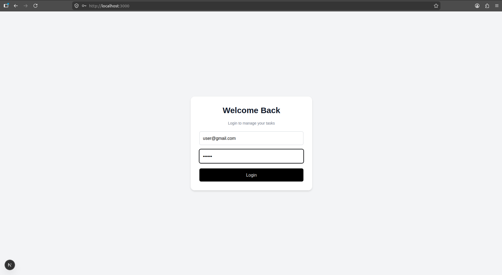
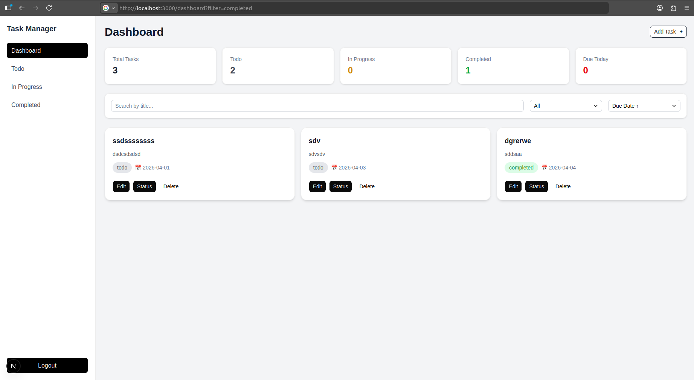
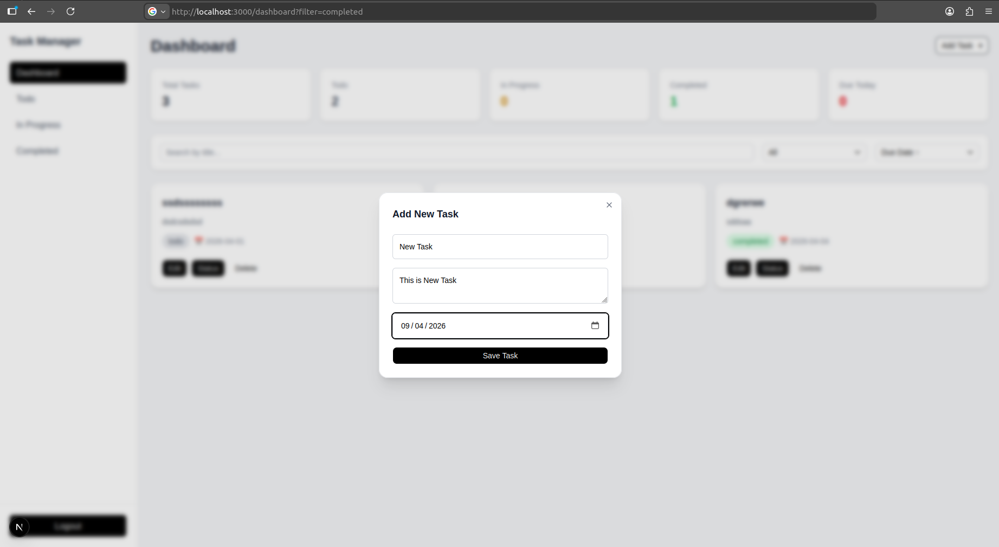

# Task Manager Application

## Description

A responsive task management application built using Next.js and Zustand.  
This project allows users to create, update, delete, and manage tasks efficiently with filtering, sorting, and status tracking.

---

## Features

- Add, edit, and delete tasks
- Task status management (Todo, In Progress, Completed)
- Search tasks by title
- Filter tasks by status
- Sort tasks by due date
- Responsive UI (mobile, tablet, desktop)
- Sidebar navigation with dynamic filtering
- Local storage-based persistence

---

## Tech Stack

- Next.js (App Router)
- React
- Zustand (State Management)
- Tailwind CSS
- shadcn/ui components

---

## Installation & Setup

Clone the repository:

```bash
git clone <your-repo-link>
cd task-manager
npm install
npm run dev
```

## Open in browser:

 http://localhost:3000

## Usage

- Login using any email and password (mock authentication)
- Add new tasks using the "Add Task" button
- Update or delete tasks from the dashboard
- Use filters and search to manage tasks efficiently
- Navigate using the sidebar to view specific task categories
---

## Folder Structure

```
src/
│
├── app/                     # Next.js App Router pages
│   ├── dashboard/          # Dashboard route
│   │   ├── layout.tsx      # Layout with sidebar
│   │   └── page.tsx        # Main dashboard page
│   │
│   └── page.tsx            # Login page (root route "/")
│
├── components/             # Reusable UI components
│   ├── common/             # Shared components
│   │   └── Sidebar.tsx     # Sidebar navigation
│   │
│   └── tasks/              # Task-related components
│       ├── AddTaskModal.tsx    # Modal to create new task
│       ├── EditTaskModal.tsx   # Modal to edit existing task
│       ├── TaskCard.tsx        # Individual task UI
│       ├── TaskFilters.tsx     # Search, filter, and sort controls
│       └── TaskStats.tsx       # Dashboard statistics cards
│
├── store/                  # Global state management
│   └── useTaskStore.ts     # Zustand store for tasks
│
└── public/                 # Static assets
    └── screenshots/        # README images
```

 ## Design 

- Zustand was used for simple and scalable global state management
- LocalStorage is used for persistence to avoid backend dependency
- Sidebar filtering is controlled via URL query parameters for better state management
- Components are modularized for reusability and maintainability
- Tailwind CSS is used for rapid UI development and responsiveness

---

## Screenshots

### Login


### Dashboard


### Add Task Modal


### Edit Task Modal

